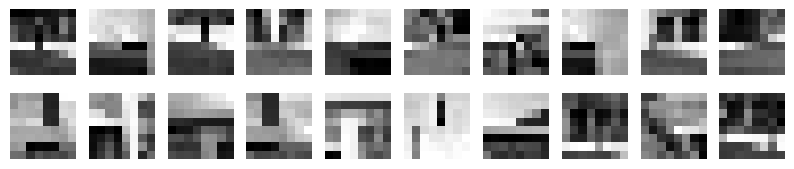
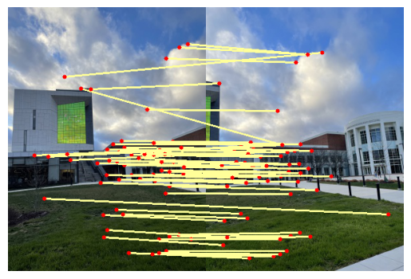
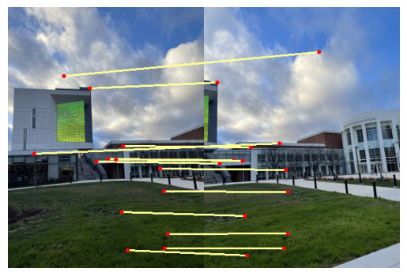
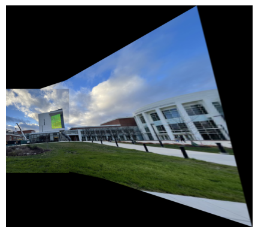

# panorama-stitching
In this project, we implement panorama stitching from scratch including corner detection, Adaptive Non-Maximal Suppression (ANMS), feature descriptor, feature matching, and RANSAC homography.
## Data
You can find the images from [here](https://drive.google.com/file/d/1kixWerF2Byv-fDbH6NdVTWQrKSk6Mkd7/view?usp=sharing).

## Usage
To stitch images, you can run the following command.
```
python3 ./Wrapper.py --BasePath {Path to your dataset}
```

You can use `--Dataset` to set the training set or testing set, and also `--Set` to select which subset of images will be stitched.
```
python3 ./Wrapper.py --BasePath {Path to your dataset} --Dataset Train --Set Set1
```

## Visualization
We have shown some result in following images.

|  | 
|:--:| 
| *Feature Descriptors* |

|  | 
|:--:| 
| *Feature Matching* |


|  | 
|:--:| 
| *Feature Matching (reject ouliers by RANSAC)* |

|  | 
|:--:| 
| *Panorama Stitching* |
